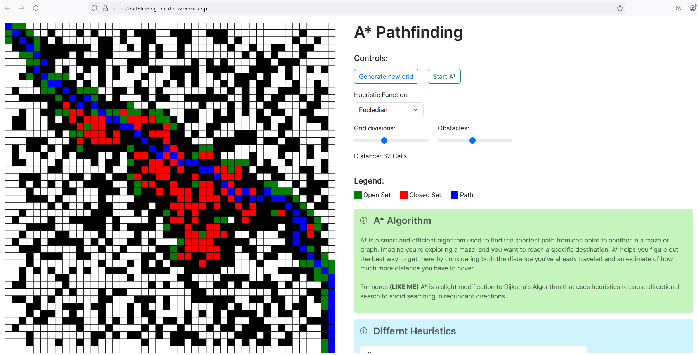

# A* Star Pathfinding

This project provides a user-friendly way to visualize the A* pathfinding algorithm. It simulates the algorithmic exploration of search space in a grid.

One can customize the size of the grid and the number of obstacles, and choose different heuristic functions to see
how they affect the efficiency and adaptability of the A* algorithm in navigating diverse environments.

## Getting Started

1. Clone the repository: `git clone [repo-link]`
2. Install dependencies: `yarn`
3. Run the development server: `yarn run dev`
4. Open your browser and navigate to [http://localhost:3000](http://localhost:3000/) to explore the A* algorithm simulation.

## Technologies Used

- Next.js
- TypeScript

## How to Contribute

We love contributions ❤️, feel free to fork the repository and submit a pull request.
